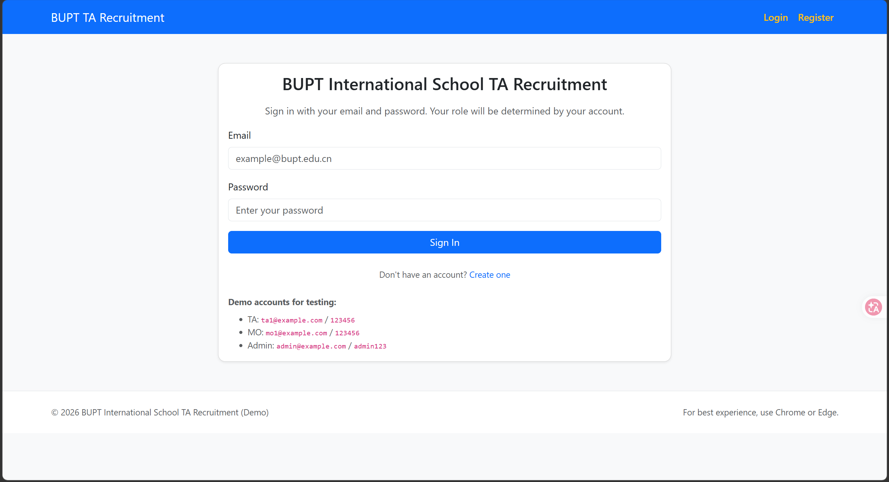
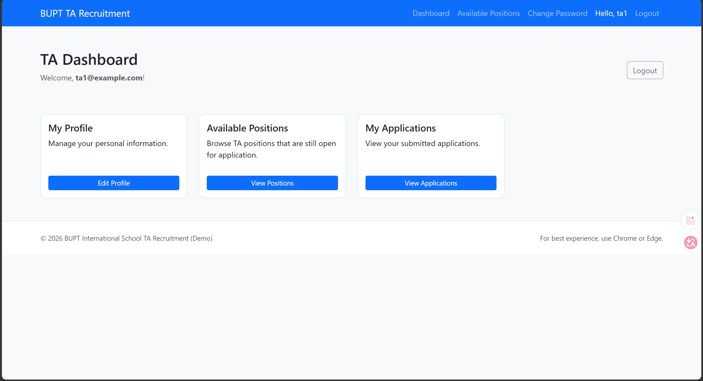
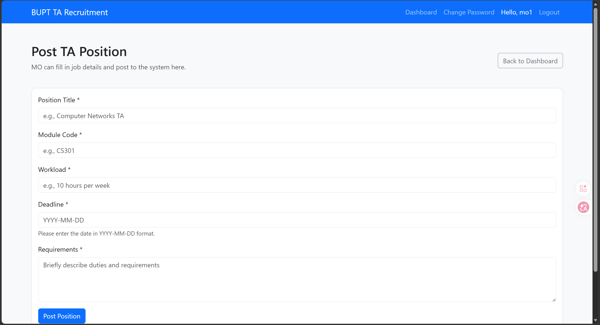
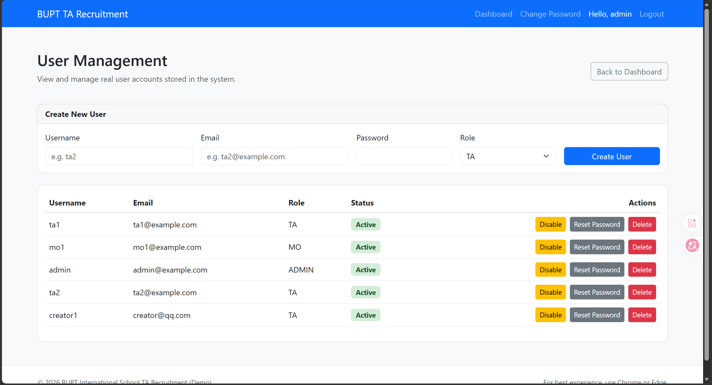

# Software Engineering Group Project - TA Recruitment System

**Project Type**: University Software Engineering Course Group Project (EBU6304)  
**Tech Stack**: Java 21 + Servlet + JSP + Embedded Tomcat 9 + Bootstrap 5  
**Build Tool**: Maven 3.6+  
**Last Updated**: May 2026

## Project Introduction

This project is a **TA (Teaching Assistant) Recruitment Management System** developed for BUPT International College. The system supports three roles:

| Role | Description |
|------|------|
| **TA** (Teaching Assistant) | Register account, fill in personal profile, upload CV, browse open positions, one-click apply, check application status |
| **MO** (Module Organizer) | All TA permissions + post/manage recruitment positions + review TA applications + view applicant profiles |
| **ADMIN** (Administrator) | All permissions + user management + account enable/disable + audit logs + system data overview |

Core Business Flow: MO posts position → TA browses and applies → MO reviews (Shortlist/Accept/Reject) → Applications automatically archived upon expiry.

## Local Environment Setup

### 1. Install Java 21+

Download and install JDK 21 or higher:

- **Oracle JDK**: https://www.oracle.com/java/technologies/downloads/
- **OpenJDK**: https://adoptium.net/download/

Verify after installation:

```bash
java -version
# Should output something like: openjdk version "21.0.x" ...
```

### 2. Install Maven 3.6+

- **Official Download**: https://maven.apache.org/download.cgi
- Download the Binary zip archive, extract it to a local directory (e.g., `C:\maven`)
- Add Maven's `bin` directory to the system environment variable `PATH`

How to set Windows environment variables:
1. Right-click "This PC" → Properties → Advanced system settings → Environment Variables
2. Under "System variables", create a new variable `MAVEN_HOME` with the value set to the Maven extraction path (e.g., `C:\maven`)
3. Edit the `Path` variable and add `%MAVEN_HOME%\bin`
4. Click OK to save

Verify installation:

```bash
mvn -version
# Should output Maven version and the Java version being used
```

### 3. Download Project Code

```bash
git clone <https://github.com/Operaer/Software-Engineering-Group-Assignment.git>
cd ta-recruitment
```

### 4. Start the Project

**Method 1: Double-click to run (Windows)**

Simply double-click the `run.bat` script in the project root directory to automatically compile and start the service.

**Method 2: Command-line run**

```bash
# Enter the project directory
cd ta-recruitment

# Compile and start the embedded Tomcat
mvn clean compile exec:java
```

The first run will have Maven automatically download dependencies (about 1-2 minutes). Please ensure a stable network connection.

## How to Access the System

### After Successful Startup

Open your browser and visit the following address:

```
http://<your-lan-ip>:8081
```

> Note: The system now binds to all network interfaces (`0.0.0.0`) and can be accessed from other computers on the same LAN, using the host machine's local IP address.



### Test Accounts

The system has three built-in demo accounts. Log in to experience the features of different roles:

| Role | Email | Password |
|------|------|------|
| TA | ta1@example.com | 123456 |
| MO | mo1@example.com | 123456 |
| ADMIN | admin@example.com | admin123 |

### New User Registration

Click the "Create one" link on the login page, fill in your email and password to register. Newly registered users are assigned the **TA** role by default.

## Project Directory Structure

```
ta-recruitment/
├── pom.xml                               # Maven project configuration
├── run.bat                               # Windows one-click startup script
├── src/main/java/com/bupt/ta/
│   ├── EmbeddedTomcat.java               # Embedded Tomcat launcher (port 8081)
│   ├── config/AppConfig.java             # Application configuration constants
│   ├── filter/
│   │   ├── AuthFilter.java               # Login authentication filter (/secure/* path)
│   │   └── EncodingFilter.java           # UTF-8 encoding filter
│   ├── model/                            # Data models
│   │   ├── User.java                     # User (TA/MO/ADMIN roles)
│   │   ├── TAProfile.java               # TA personal profile
│   │   ├── Job.java                      # Recruitment position
│   │   ├── Application.java             # Application record
│   │   ├── AdminDashboardStats.java     # Administrator dashboard statistics
│   │   ├── JobHistoryEntry.java         # Job history entry
│   │   └── AuditLogEntry.java           # Audit log entry
│   ├── security/PermissionChecker.java   # Page-level permission check
│   ├── servlet/                          # Controller layer (Servlets)
│   │   ├── BaseServlet.java             # Base Servlet (provides login verification/forwarding utility methods)
│   │   ├── LoginServlet.java            # Login processing
│   │   ├── LogoutServlet.java           # Logout processing
│   │   ├── RegisterServlet.java         # User registration
│   │   ├── DashboardServlet.java        # Dashboard (routed by role)
│   │   ├── ProfileServlet.java          # TA profile editing
│   │   ├── ChangePasswordServlet.java   # Change password
│   │   ├── ApplicationServlet.java      # TA application management
│   │   ├── QuickApplyServlet.java       # One-click apply
│   │   ├── PostJobServlet.java          # MO post job
│   │   ├── ManageJobServlet.java        # MO manage jobs
│   │   ├── ResumePreviewServlet.java    # Resume preview
│   │   ├── ResumeDownloadServlet.java   # Resume download
│   │   ├── AdminDashboardServlet.java   # Administrator dashboard
│   │   ├── AdminWorkloadServlet.java    # Workload management
│   │   ├── AdminApplicationManagementServlet.java  # Administrator application management
│   │   ├── AdminAuditLogsServlet.java   # Audit log viewing
│   │   └── UserManagementServlet.java   # User management (enable/disable accounts)
│   └── storage/                          # Data persistence layer (JSON/text file storage)
│       ├── UserStorage.java
│       ├── ProfileStorage.java
│       ├── JobStorage.java
│       ├── ApplicationStorage.java
│       ├── JobHistoryStorage.java
│       └── AuditLogStorage.java
├── src/main/webapp/
│   ├── index.jsp                         # Login page
│   ├── register.jsp                      # Registration page
│   ├── WEB-INF/
│   │   ├── includes/
│   │   │   ├── header.jsp               # Page header (navigation bar)
│   │   │   ├── base_dashboard.jsp       # Unified dashboard
│   │   │   └── footer.jsp               # Page footer
│   │   ├── data/                         # Data files (JSON/txt)
│   │   └── uploads/                      # Resume upload directory
│   ├── secure/                           # Pages requiring login
│   │   ├── account/change_password.jsp   # Change password
│   │   ├── ta/                           # TA-specific pages
│   │   │   ├── dashboard.jsp
│   │   │   ├── available_positions.jsp  # Browse open positions
│   │   │   ├── position_details.jsp     # Position details
│   │   │   ├── applications.jsp         # My applications
│   │   │   └── profile.jsp             # Personal profile
│   │   ├── mo/                           # MO-specific pages
│   │   │   ├── dashboard.jsp
│   │   │   ├── post_position.jsp        # Post position
│   │   │   ├── manage_positions.jsp     # Position management
│   │   │   ├── application_list.jsp     # Application review
│   │   │   ├── job_history.jsp          # Job history
│   │   │   └── edit_position.jsp        # Edit position
│   │   └── admin/                        # Administrator-specific pages
│   │       ├── dashboard.jsp
│   │       ├── user_management.jsp       # User management
│   │       ├── application_list.jsp     # Global application management
│   │       ├── audit_logs.jsp           # Audit logs
│   │       └── system_settings.jsp      # System settings
│   └── assets/css/style.css              # Custom styles
└── tomcat.8080/                          # Tomcat runtime working directory (auto-generated, do not modify manually)
```

## Main Features Overview



### TA User
- Register account, login/logout
- Fill/edit personal profile (name, student ID, major, phone, skills)
- Upload/update resume (PDF)
- Browse open position list
- View position details
- **One-click apply** (Quick Apply) — automatically checks profile completeness
- Check application status (Pending → Shortlisted → Accepted/Rejected → Expired)
- Change password



### MO User
- All TA features
- Post new recruitment positions (job title, module code, workload, deadline, requirements)
- View/edit/delete posted positions
- Review TA applications (Shortlist / Accept / Reject)
- View applicant full profiles and resumes
- View job history records



### ADMIN User
- Global dashboard (user count, job count, application count statistics)
- User management (view all users, enable/disable accounts)
- Global application management
- Workload allocation
- Audit logs (records all critical operations)
- System settings

## Frequently Asked Questions (FAQ)

**Q: `Address already in use` error on startup?**
A: Port 8081 is occupied. Modify the `port` variable value on line 15 of `src/main/java/com/bupt/ta/EmbeddedTomcat.java` (e.g., change to 8082), then recompile and start.

**Q: `mvn` command not found?**
A: Maven is not configured correctly. Check two things:
1. Whether the `MAVEN_HOME` environment variable points to Maven's extraction directory
2. Whether `%MAVEN_HOME%\bin` has been added to `Path`
After configuration, reopen a new command-line window and try again.

**Q: Chinese characters display as garbled text on the page?**
A: Check if the IDE's file encoding is set to UTF-8. If using IDEA, check `Settings → Editor → File Encodings` and set all encodings to UTF-8.

**Q: Data from before is gone after `mvn clean`?**
A: The project uses file storage, with data located under `src/main/webapp/WEB-INF/data/`. `mvn clean` deletes compilation artifacts, but the data files are not in the target directory so they will not be lost. If they are truly lost, check if the data directory was manually deleted.

**Q: How to add new test users?**
A: Click "Create one" on the login page to self-register, which assigns the TA role by default. For MO or ADMIN roles, an existing ADMIN account needs to modify the role on the user management page.

**Q: Dependency download failure on first startup?**
A: The Maven Central Repository network may be unstable. Try the following:
1. Check network connection (especially on campus networks)
2. Delete the corresponding failed cache in `~/.m2/repository` and retry
3. Configure a Maven mirror (such as Aliyun or other domestic mirrors) in `~/.m2/settings.xml`

## Notes

1. **Data Storage**: Currently uses JSON/text files for data storage, located in the `src/main/webapp/WEB-INF/data/` directory. `mvn clean` will not affect these data files, but manually deleting files in the data directory will cause data loss.
2. **Port Conflict**: If port 8081 is occupied, modify the `port` variable in `EmbeddedTomcat.java`.
3. **LAN Access**: The system is bound to all available network interfaces, so other computers on the same LAN can access it using the host machine's IP address, for example `http://192.168.1.100:8081`.
4. **Resume Upload**: Uploaded resumes are stored in the `WEB-INF/uploads/` directory.

---

| GitHub Username | QMID |
| --- | --- |
| qin204 | 231223380 |
| Cloudiers1 | 231223405 |
| Operaer | 231223391 |
| MY123456-A11Y | 231223427 |
| Zzc-bot | 231223346 |
| Joseph1Stalin | 231223416 |